# **FastBinds User Guide**
## **Introduction**
### *What is FastBinds?*
FastBinds is a GMOD Addon that allows you to use *complex* binds at the click of a button.
### *What can the addon do?*
The addon has up to 5 different types of customizable binds, all of which can be accessed and ran through the open menu bind. If you already have some binds, on the left-hand side you will see different "tabs" that contain some of your binds.

Within each tab you will have several binds, each consisting of 3 Text Entry Field (referred henceforth as Field 1 / Field 2 / Field 3, depending on their position from left to right) and above them a Labeled Button.

**Preview:**

Show/Hide
 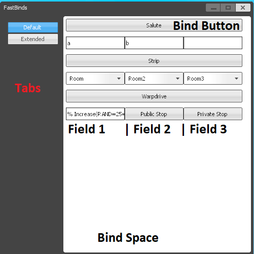 

### *Types of Binds*
1. [Text Binds](#TextBinds "Jump")
2. [Field Text Binds](#FieldBinds "Jump")
3. [Dropdown Text Binds](#DropdownBinds "Jump")
4. [Adder Binds](#AdderBinds "Jump")
5. [Stopper Binds](#StopperBinds "Jump")

### **Text Binds:**

Text binds are like your regular binds in GMOD. There is nothing special about them other than you no longer need to press a keyboard button, but a button on-screen. It can save space for critical binds. (such as salute,wave, or other binds done on the spot)  
**Preview button:**

Show/Hide
 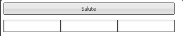 

**Preview output:**

Show/Hide
 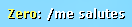 

### **Field Text Binds:** 

Field Text Binds are like text binds only that you once the bind is triggered (the button is pressed), according to user specifications, the text in the fields below the button will be put into the output text. Each field can have a default value.

**Preview button:**

Show/Hide
 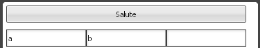 

**Preview output:**

Show/Hide
 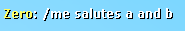 

### **Dropdown Text Binds:**

Like Field Text Binds only that instead of having any options, you can choose from a dropdown of options specified beforehand by the user.

### **Adder Binds:**

Adder Binds are specialized binds. They are most likely not needed by everyone. In StarWars Roleplay, the Imperial Engineers usually need to count up to 100% when doing a specialized Task. With this type of bind, it will be reduced to a simple button press. Adder bind's different settings cannot be edited through the in-game field, but it is still 100% customizable like the other type of binds. More details in the "How-to" Section.

### **Stopper Binds:**

Stopper Binds are used alongside Adder Binds. They will stop the counter such that if the person who started the scan want's to stop it before completion or, in case of a misclick, it can be stopped. They can be silent (private) such that the adder's stop is not announced in chat or public, that when the stopper is triggered it will go alongside with a message.

It will also transform a field into a button labelled with "Public Stop" or "Private Stop".
___

## The Basic Guide to your new binds!

Preface: Lines that start with `#` are comments, they are just explications shown here but they should not be put into the binds.

First, let's understand how to access your binds.

The bind menu can be accessed through the console command `FastBindMenu`. For now it will look like so: 

Show/Hide
 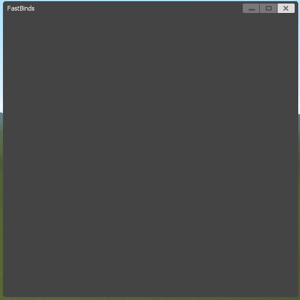 

Very Empty...

To add Binds or Tabs we must first go to the game's install folder. From here go to the games `data` folder (`installFolder\garrysmod\data`). For me the folder was situated in `E:\Steam\steamapps\common\GarrysMod\garrysmod\data` but yours might be somewhere else.

Here you will see an empty file named `FastBinds_SaveData`. Open it in your favourite text editor. After a modification please save the file, and re-open the Fast Bind Menu in-game for changes to take effect.

Let's first add a Tab. To do so you must add it's named , on the next line `"""` after which our binds will be situated and at the end we will put `"""` again. Let's call our new tab `Default`.
> Default 
> """  
> \# The binds situated in the "Default" tab 
> """

Here I will remind you that all lines that start with `#` are bits of information that **should not** go into the folder. If you intend to copy-paste remove all lines that start with `#`.

Let's see how it looks now!

Show/Hide
  

Still Looks pretty empty. Let's make a salute bind!

We will want it to show in chat `/me Salutes with respect and CHEESE`. This is just an example of the first type of binds, [Text Binds](#TextBinds "Jump").

Between the two lines of `"""` binds will be added there, one on each line.

A bind has 5 main sections, It's Label (the text on the button), the actual message and the 3 different values from Field 1 to Field 3. For now, they will remain empty.

Each of the sections will be separated by `|//`. Our bind should then look something like this:
> Salute|///me Salutes with respect and CHEESE|//|//|//

Or for Better visibility:

> Salute |// /me Salutes with respect and CHEESE |// |// |//

The Second method is **not** going to produce the same values as the first. The second one will have a space after the "Salute" text and a space before and after the message. Usually, this will break text commands like /me, /advert, /comms etc.
As such use the first version, but for clarity, the second version will be displayed in this documentation.

Let's see how it looks!

Show/Hide
 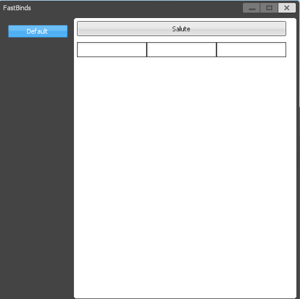 

And Let's press the button! 

Show/Hide
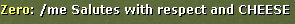

Great! you are now able to experience the base experience of using binds in GMOD! But we aren't here for child's play! Let's get more bind-y!

Let's talk about [Field Text Binds](#FieldBinds "Jump"). To add one, in the message add `{|1|}` or `{|2|}` or `{|3|}` or two of the three or all three! Go wild! What these do is once the button is pressed, in place of them will be shown the text located in the corresponding Field. To give the fields a default value simply add it to its section! 

Let's make a copy of our salute bind and instead of `CHEESE` let's add `{|2|}`. In the second field section, let's add the default text `Bob`.

Our new bind should look like this:
> Salute|///me Salutes with respect and {|2|}|//|//Bob|//

Here is a version **just for clarity! :**
> Salute |// /me Salutes with respect and {|2|} |// |// Bob |//

So as a whole our text file should look like so:

Here is how it will now look:

Show/Hide
 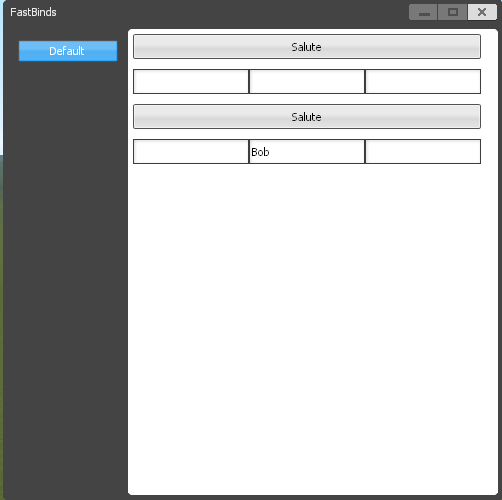 

And Let's press the button! 

Show/Hide
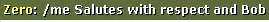

But now the sentence doesn't make sense! Let's change it to `more respect` instead of `Bob` but, for the sake of it, let's say that we still want to keep `Bob` as the default value. In the second Field, you can type anything, in our case, let's type `more respect`. It should look like this:

Show/Hide
 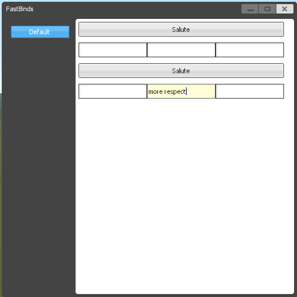 

And let's see the output!

Show/Hide
 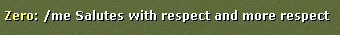 

Great!

Now, for the last part of the basic guide let's talk about [Dropdown Text Binds](#DropdownBinds "Jump").

Let's make another bind. Let's say you want to announce to the world you will now be hosting a party somewhere. The only three places you can hold parties is at `my house`, `the restaurant` or `the MOOOOON!`. Instead of typing each one in the text Field, let's use dropdowns!

Let's use the name for the bind `Party at...` and for the message, we will use `/advert Come one, come all! Party at {|1|}`. In the first field's default text section, we need to add at the start `||DROPDOWN||`.

To add options to the dropdown, they will all come after `||DROPDOWN||` and each separated by `||`. for our case it should look like this: `||DROPDOWN||my house||the restaurant||the MOOOOON!`. The first option is always the default option! Here is how the bind looks:

> Party at...|///advert Come one, come all! Party at {|1|}|//||DROPDOWN||my house||the restaurant||the MOOOOON!|//|//

This line is quite long so if your monitor resolution is on the lower side of things, trust me, it is all on one line!

Let's see how the menu looks like!

Show/Hide
 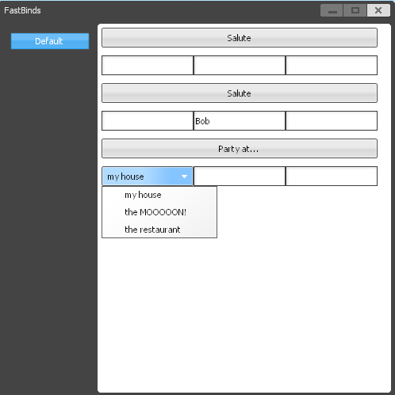 

And let's select each one of them and let's press the button!

Show/Hide
 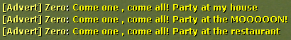 

Our text file looks like this:
> Default  
> """  
> Salute|///me Salutes with respect and CHEESE|//|//|//  
> Salute|///me Salutes with respect and {|2|}|//|//Bob|//  
> Party at...|///advert Come one , come all! Party at {|1|}|//||DROPDOWN||my house||the restaurant||the MOOOOON!|//|//  
> """  

Wonderful! This all for the basic guide! If you want to know how to use Adders and Stoppers I suggest you first understand the different syntaxes used in this guide and also you are comfortable with using the first 3 kinds of binds.

___

## The Advanced Guide to your new binds!

In this guide, we will talk about Adders and Stoppers. There is nothing significantly more difficult than a simple bind.

Adder binds, as the name suggests, add numbers. Well, not exactly, but they if we have a message that we want to repeat after some time multiple times but increasing a number in the process, we would use an Adder. Let's make the bind! 
First let's give it a name: `Hostile Scan` 
Second let's give it a message: `/advert -=SC=- [ Hostile Scan Status: {|A1|}% Done]`

The place where the number will go is noted using `{|A1|}`. 

Now, you must know that the adder can **only go into the first field**!

Here is it's syntax:  
`||ADDER||Comment||Starting Number||Ending Number||Digits after dot to be shown||Number to add after a delay||Delay between messages(seconds)||Timer Name`

The `Comment` is just a placeholder text added in the field to indicate it is being used by the adder and by how much it increases. If we have it be `% increase` and we increase it by `20` every time in the Text Field in-game it will show `% increase(20)`. The text can be edited but it will have no effect.

The `Timer Name` is a unique identifier used by Stoppers to be able to stop the adder. Do not leave blank!

If a mistake is made and such that the timer will never end and no stopper is in place, a full re-connect of the client/user must be done!

Here is how it will look for us:
> ||ADDER||% Increase||0||100||2||45||10||HostileScanTimer

And in the bind:
> Hostile Scan|///advert -=sc=- [ Hostile Scan Status: {|A1|}% Done]|//||ADDER||% Increase||0||100||2||45||10||HostileScanTimer|//|//

In-Game:

Show/Hide
 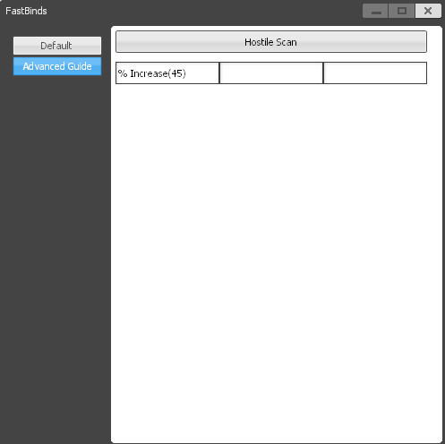 

Output (after 30 total seconds):

Show/Hide
 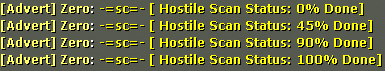 

But we can also give it random numbers to add by, to spice up the gameplay!

To do so, instead of the `45` or whatever number you choose to increase the timer by, you can put in `RAND=Minimum_Random=Maximum_Random`

Let's say we want to increase between 30 and 60 at a time. We will replace it with: `RAND=30=60`

Our final bind will be:
> Hostile Scan|///advert -=sc=- [ Hostile Scan Status: {|A1|}% Done]|//||ADDER||% Increase||0||100||2||RAND=30=60||10||HostileScanTimer|//|//

Here is how the menu looks:

Show/Hide
 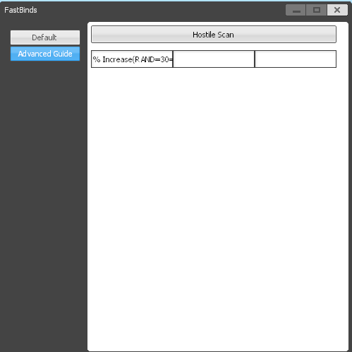 

Output (after 30 total seconds):

Show/Hide
 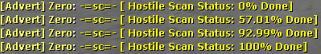 

Great! Let's now use stoppers in case it gets out of hand!

First, let's understand what the difference between a public stop and a private stop is. A public stop will stop the adder but also put in chat a given message. A private stop will only stop the adder.

Stoppers can only go in Fields 2 and 3!

The syntax: 
`||STOPPER||Timer Name||Public?(true/false)||Message`

Let's make both a public stop in field 2 and a private one in field 3.Here is our syntaxes: 
`||STOPPER||HostileScanTimer||true||/advert -=SC=- Hostile Scan has been stopped!` 
and  
`||STOPPER||HostileScanTimer||false||Doesn't matter what I type here`

So our bind will be:
> Hostile Scan|///advert -=sc=- [ Hostile Scan Status: {|A1|}% Done]|//||ADDER||% Increase||0||100||2||RAND=30=60||10||HostileScanTimer|//||STOPPER||HostileScanTimer||true||/advert -=SC=- Hostile Scan has been stopped!|//||STOPPER||HostileScanTimer||false||Doesn't matter what I type here

Here is in-game:

Show/Hide
 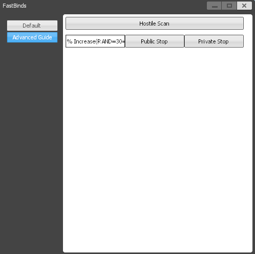 

After we stop it publicly (after 10 seconds):

Show/Hide
 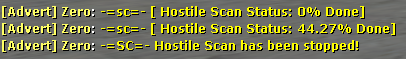 

After we stop it privately (after 10 seconds):

Show/Hide
 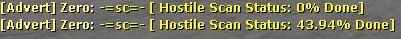 

That is all! Have fun!